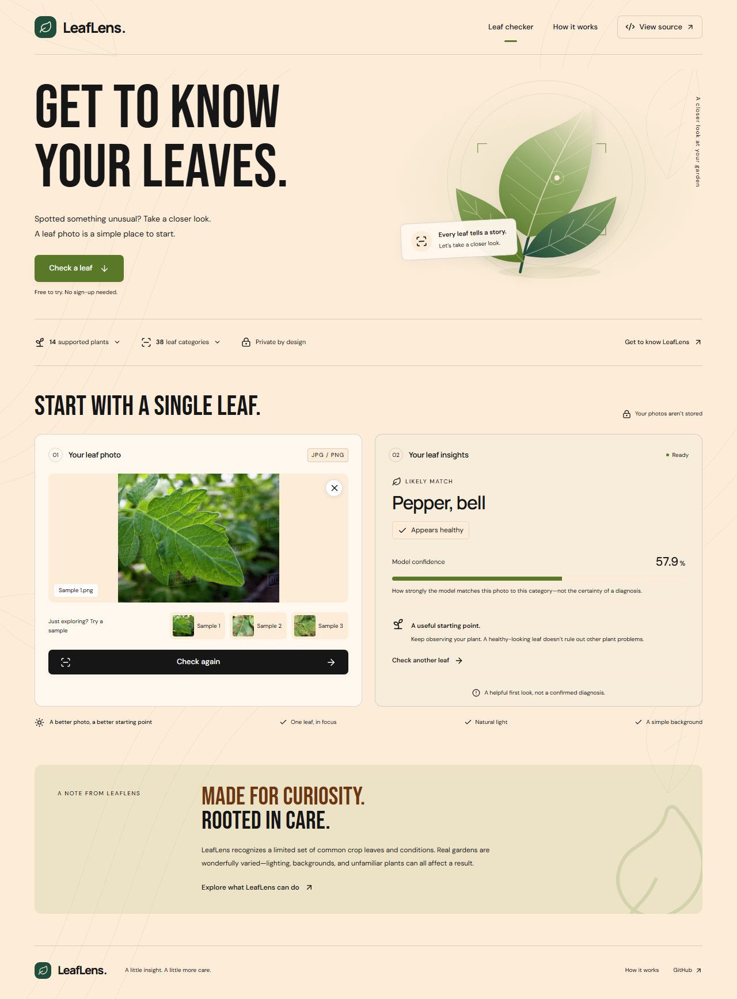
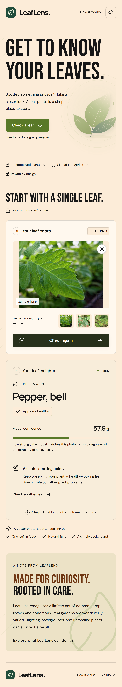
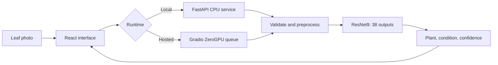

# LeafLens

**A closer look at your plant leaves.**

Upload a leaf photo, explore a likely plant and condition match, and understand what the result means. LeafLens pairs a responsive interface with an existing image-classification model covering **14 plants and 38 leaf categories**.

[**Try the live demo →**](https://ranaumarbilal31-leaflens.hf.space/) · [How it works](https://ranaumarbilal31-leaflens.hf.space/how-it-works) · [Hugging Face Space](https://huggingface.co/spaces/ranaumarbilal31/leaflens)

[](https://github.com/ranaumarbilal31/leaflens/actions/workflows/check.yml)



<details>
<summary>View the mobile interface</summary>



</details>

## Features

- Upload a JPEG or PNG, or start with one of three sample photos.
- See the predicted plant, likely condition, and confidence in plain language.
- Open compact lists of supported plants and leaf categories on demand.
- Check another photo with clear skeleton loading, error, retry, and reset states.
- Use desktop or mobile layouts, keyboard controls, and reduced-motion support.
- Read the separate explanation page for model details and limitations.

No app account, database, or upload history is required. Uploaded photos are processed in memory; the application does not save them or use them for training.

> **A useful first look, not a diagnosis.** The model always selects a known category, including for unrelated images. Confidence is not a calibrated probability that a plant has a disease.

## Supported plants

| Plant | Categories | Plant | Categories |
| --- | ---: | --- | ---: |
| Apple | 4 | Pepper, bell | 2 |
| Blueberry | 1 | Potato | 3 |
| Cherry | 2 | Raspberry | 1 |
| Corn | 4 | Soybean | 1 |
| Grape | 4 | Squash | 1 |
| Orange | 1 | Strawberry | 2 |
| Peach | 2 | Tomato | 10 |

Coverage varies by plant: some have only a healthy-leaf category. See the [full category list](https://ranaumarbilal31-leaflens.hf.space/how-it-works) or the canonical class order in [api/inference.py](api/inference.py).

## Run locally

Use **Python 3.11** and **Node.js 22**. The trained checkpoint is included; no training or dataset download is needed.

```sh
git clone https://github.com/ranaumarbilal31/leaflens.git
cd leaflens
python -m venv .venv
```

Activate the environment:

```sh
# macOS / Linux
source .venv/bin/activate
```

```powershell
# Windows PowerShell
.venv\Scripts\Activate.ps1
```

Install dependencies, build the interface, and start the CPU service:

```sh
python -m pip install -r requirements.txt
npm ci --prefix web
npm run build --prefix web
python -m uvicorn api.main:app --host 127.0.0.1 --port 7860 --no-access-log
```

Open **http://127.0.0.1:7860**. For frontend development, keep the service running and use `npm run dev --prefix web` in another terminal; Vite proxies `/api` to the backend.

### Docker

```sh
docker build -t leaflens .
docker run --rm -p 7860:7860 leaflens
```

The container runs as a non-root user with CPU-only PyTorch and a health check. It serves the interface and API together.

## Architecture



| Layer | Implementation |
| --- | --- |
| Interface | React, TypeScript, Vite, custom CSS, Lucide icons |
| Local API | FastAPI, bounded CPU inference |
| Hosting | Gradio and Hugging Face ZeroGPU, one concurrent prediction |
| Model | PyTorch ResNet9 with the supplied 38-output checkpoint |
| Images | Pillow, EXIF correction, RGB conversion, white transparency compositing |
| Verification | Pytest, Playwright, axe accessibility checks, GitHub Actions |

Images are limited to **10 MB and 20 megapixels**, resized to **256 × 256** with bilinear interpolation, and scaled from 0–255 to 0–1. Class-index order is preserved. Weights load once using `weights_only=True`; inference runs with gradients disabled. Selecting another photo cancels the pending UI request and clears stale results.

### API

| Route | Purpose |
| --- | --- |
| `GET /api/health` | Model readiness |
| `GET /api/categories` | Supported plant/condition pairs |
| `GET /api/runtime` | Interface transport configuration |
| `POST /api/predict` | Local CPU prediction; multipart field `image` |

```sh
curl -F "image=@test images/1.png" http://127.0.0.1:7860/api/predict
```

```json
{
  "class_id": 19,
  "label": "Pepper, bell - Healthy",
  "plant": "Pepper, bell",
  "condition": "Healthy",
  "confidence": 57.9
}
```

This is an example checkpoint result, not a ground-truth label for the photo. The hosted interface uses Gradio's queued `check_leaf` endpoint instead of `/api/predict`, preserving ZeroGPU's allocation and quota controls. Photos are transmitted as base64 to avoid Gradio's file-upload disk cache.

## Free hosting

The public demo runs on **Hugging Face Spaces ZeroGPU**. No paid hardware or services are configured. Shared queues, idle wake-up delays, and visitor quotas apply; repeated checks may reach the anonymous allowance. The app displays a retry-later message when this happens. Free hosting does not provide an uptime guarantee.

To test the hosted adapter locally after building the interface:

```sh
python -m pip install -r requirements-space.txt
python -m space.backend
```

The adapter uses CPU locally and ZeroGPU on Spaces. Hosted Python is 3.12. Releases contain the application, built interface, attribution, and unchanged model. [app.py](app.py) downloads a pinned release and verifies its SHA-256 before starting it. The [release workflow](.github/workflows/release-space.yml) packages an existing release tag. Updating the deployment requires changing both the release URL and checksum in the Space entry point.

## Verification

With the built local application running on port 7860:

```sh
python -m pip install -r requirements-dev.txt
python -m pytest tests -q
cd web
npx playwright install chromium
npm run test:e2e
npm run format:check
```

Backend checks exercise the real checkpoint, all samples, repeat predictions, image variants, EXIF orientation, malformed files, size limits, and concurrency. Browser checks cover desktop/mobile flows, stale responses, keyboard access, expandable lists, retries, skeleton states, and accessibility. GitHub Actions builds the Linux container, runs backend tests, and verifies a real prediction from the running service.

Live checks are subject to hosting quotas; use the local service for repeated tests. Set `LEAFLENS_URL` to select another running deployment for browser tests.

## Search and agent access

Search and agent access are documented in [Search and crawler setup](docs/discoverability.md). Both public pages are prerendered with metadata; the app includes a sitemap, crawler rules, and a supplemental agent reading guide. Search-engine inclusion is not guaranteed.

## Model limitations and attribution

The architecture follows [Atharva Ingle's ResNet9 reference notebook](https://www.kaggle.com/atharvaingle/plant-disease-classification-resnet-99-2), which uses augmented data derived from [PlantVillage](https://github.com/spMohanty/PlantVillage-Dataset). The exact training history of the supplied weights has not been independently verified. No retraining was performed for this application.

- Field conditions, lighting, backgrounds, multiple leaves, and unfamiliar plants can reduce reliability.
- The model cannot reliably reject non-leaf photos or recognize every disease.
- Confidence is a softmax score, not a confirmed diagnosis or independently measured accuracy.
- Important plant-care decisions should be confirmed with a qualified local expert.

The unrelated 14-class notebook is not the deployed model specification. Original academic documents and notebooks remain excluded from the public application. See [third-party acknowledgements](THIRD_PARTY_NOTICES.md) for the model, dataset, fonts, and icons, and [included font licenses](web/public/licenses). No blanket license grant is made for third-party weights or other upstream materials.
