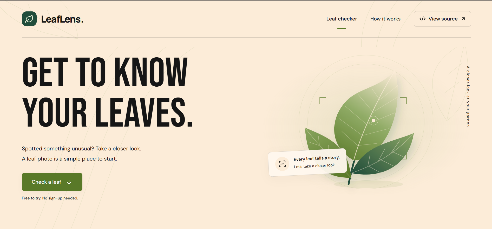
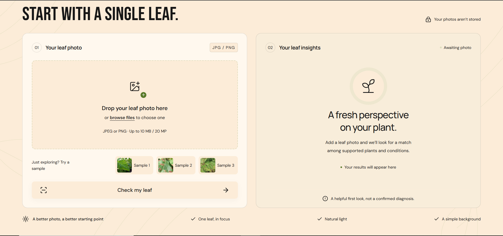

<div align="center">

# 🌿 LeafLens

**Upload a leaf photo, get a possible plant-health match in seconds.**

A leaf-photo checker with a React + TypeScript interface and a FastAPI / PyTorch inference service.

[Live demo](https://ranaumarbilal31-leaflens.hf.space) · [How it works](https://ranaumarbilal31-leaflens.hf.space/how-it-works) · [Report an issue](https://github.com/ranaumarbilal31/leaflens/issues)


</div>

---

## Overview

LeafLens classifies a single leaf photo into one of **38 categories** covering **14 plants**. Each category is a plant paired with either a disease/condition or a healthy label. It is built around an existing ResNet9 image-classification checkpoint; **no new training happens in this project**. The work here is the application around the model: validated uploads, fixed-size preprocessing, accessible UI states, and inference with bounded concurrency.

> ⚠️ **LeafLens is an exploration tool, not a diagnostic service.** Results are possible matches, not confirmed diagnoses. Confirm important plant-care decisions with a qualified local expert.

## Screenshots

<div align="center">

| Home | Preview |
| :---: | :---: |
|  |  |

</div>

## Features

- **Simple flow:** upload one JPEG or PNG and get the top category with its softmax score.
- **Careful preprocessing:** file validation, EXIF orientation correction, RGB conversion, resize to 256 × 256, and transparent backgrounds composited onto white.
- **Privacy-minded:** photos are processed in memory and never saved or used for training.
- **Two runtimes:** a local CPU build (FastAPI) and a hosted build on Hugging Face ZeroGPU (Gradio adapter).
- **Health endpoint:** `/api/health` is available in both modes.
- **Tested:** Python unit tests (`pytest`) and browser end-to-end tests (Playwright).
- **Containerized:** ships with a Dockerfile; CI workflows live in `.github/workflows`.

## How it works

1. **Upload.** The server validates the file, fixes orientation, converts to RGB, and resizes to 256 × 256.
2. **Inference.** Pixel values are scaled from 0–255 to 0–1 (matching the reference notebook) and passed through a ResNet9 model.
3. **Result.** The highest-scoring category is returned with its softmax score. This score is **not** a calibrated probability of disease.

The hosted demo uses a shared GPU queue; local runs use the CPU.

## Tech stack

| Layer | Technology |
| --- | --- |
| Frontend | React, TypeScript (built with npm / Node.js 22) |
| Backend | FastAPI, Uvicorn |
| Model | PyTorch, ResNet9 (38 outputs) |
| Hosted adapter | Gradio on Hugging Face Spaces (ZeroGPU) |
| Testing | pytest, Playwright |
| Packaging | Docker |

## Repository structure

> Based on the top-level layout; see each folder for details.

```
leaflens/
├── .github/workflows/   # CI workflows
├── api/                 # FastAPI service (api.main:app)
├── models/              # Model architecture / checkpoint handling
├── scripts/             # Helper scripts
├── space/               # Hugging Face Space adapter (space.backend)
├── test images/         # Sample leaf photos for trying the app
├── tests/               # Python tests
├── utils/               # Shared utilities (e.g. preprocessing)
├── web/                 # React + TypeScript interface
├── app.py               # Hugging Face Space entry point
├── Dockerfile
├── requirements.txt         # Local CPU service
├── requirements-space.txt   # Hosted (Space) adapter
├── requirements-dev.txt     # Test/development tools
└── THIRD_PARTY_NOTICES.md
```

## Getting started

### Prerequisites

- Python 3.11
- Node.js 22

### Run locally (CPU)

```bash
# 1. Install Python dependencies
python -m pip install -r requirements.txt

# 2. Build the interface
cd web
npm ci
npm run build
cd ..

# 3. Start the server
python -m uvicorn api.main:app --host 127.0.0.1 --port 7860
```

Open <http://localhost:7860>.

### Run with Docker

```bash
docker build -t leaflens .
docker run -p 7860:7860 leaflens
```

### Test the hosted adapter locally

After building the interface:

```bash
python -m pip install -r requirements-space.txt
python -m space.backend
```

This uses the CPU locally and the ZeroGPU queue when running on Spaces. The Space bootstrap downloads a checksum-verified release bundle containing the built interface, application code, and original checkpoint.

## API

| Endpoint | Mode | Description |
| --- | --- | --- |
| `POST /api/predict` | Local CPU | Submit a leaf image, receive the top category and score |
| `GET /api/health` | Local + hosted | Health check |
| Gradio `check_leaf` | Hosted | Same-origin endpoint used by the custom UI on Spaces |

## Testing

```bash
python -m pip install -r requirements-dev.txt
python -m pytest tests

cd web
npm run build
npm run test:e2e
```

The browser tests expect the built app running on port 7860 and a Playwright Chromium installation (`npx playwright install chromium`).

## Hosted demo notes

The live demo runs on Hugging Face's free ZeroGPU tier. Expect a shared queue, wake-up delay on first load, and daily usage quotas. No paid services are configured.

## Model provenance

- The supplied checkpoint has 38 outputs and uses the ResNet9 architecture from the [reference notebook by Atharva Ingle](https://www.kaggle.com/atharvaingle/plant-disease-classification-resnet-99-2).
- That notebook uses augmented data derived from [PlantVillage](https://github.com/spMohanty/PlantVillage-Dataset).
- The exact training history of the supplied weights is **not independently verified**.
- A separate 14-class notebook from the original project does not describe the deployed model.

## Limitations

- Training data is mostly isolated leaves under controlled conditions. Field photos, unusual lighting, multiple leaves, and busy backgrounds can reduce reliability.
- The model always picks from its 38 known categories. It **cannot reliably reject** non-leaf or unrelated images.
- Coverage differs by plant, and not every plant disease is represented.
- No independently verified field accuracy is claimed, and notebook accuracy figures are not presented as LeafLens performance.

## Privacy

Uploaded photos are processed in memory, are not persisted, and are not used for training.

## Acknowledgements

- [Atharva Ingle](https://www.kaggle.com/atharvaingle/plant-disease-classification-resnet-99-2) for the reference ResNet9 notebook
- [PlantVillage](https://github.com/spMohanty/PlantVillage-Dataset) for the underlying dataset
- See [`THIRD_PARTY_NOTICES.md`](THIRD_PARTY_NOTICES.md) for full third-party attributions

## License

This project is licensed under the [MIT License](LICENSE).

## Author

**Rana Umar Bilal**

[](https://github.com/ranaumarbilal31)

If you find LeafLens useful, consider giving the repo a ⭐